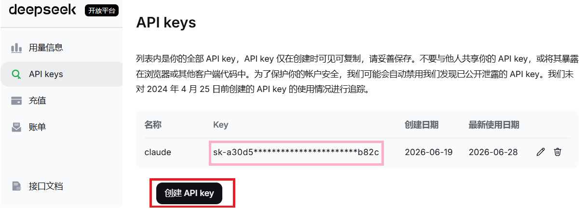
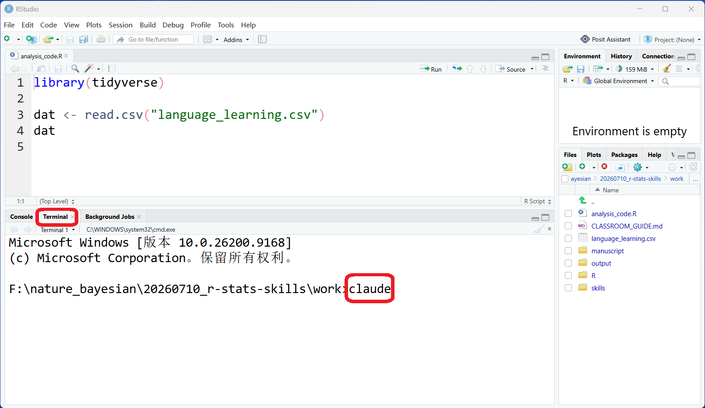
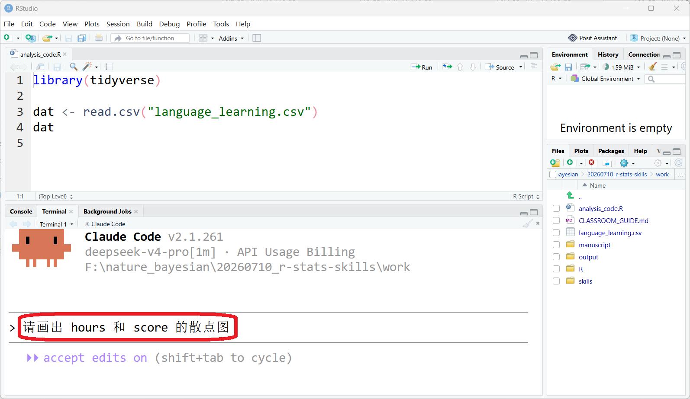
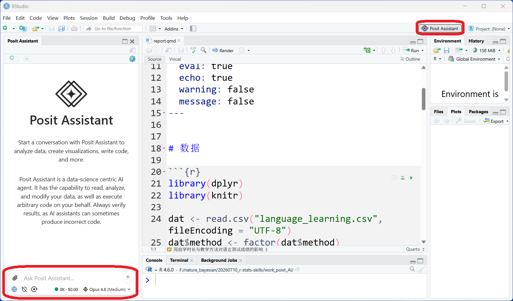

```{r setup, include=FALSE}
knitr::opts_chunk$set(
  echo       = TRUE,
  message    = FALSE,
  warning    = FALSE,
  out.width  = "100%",
  fig.asp    = 0.618,
  fig.show   = "hold",
  fig.pos    = "center",
  fig.align  = "center",
  dpi        = 600
)

options(
  digits = 3,
  knitr.table.format = "html"
)
```

```{css, echo=FALSE}
/* 1) 加载 Google 字体（在线渲染需要网络） */
@import url('https://fonts.googleapis.com/css2?family=Fira+Mono:wght@400;500;700&display=swap');

/* 2) 只改代码字体 */
.remark-code, .remark-code * { 
  font-family: "Fira Mono", ui-monospace, SFMono-Regular, Menlo, Monaco, Consolas, "Liberation Mono", "Courier New", monospace !important;
}
.remark-inline-code {
  font-family: "Fira Mono", ui-monospace, SFMono-Regular, Menlo, Monaco, Consolas, "Liberation Mono", "Courier New", monospace !important;
}
```


---
class: center, middle
 
# 一、准备


---
## 配置环境

<br>

| 名称     | 功能            | 链接                                           | 安装位置      |
|:-------: | :--------------:| ---------------------------------------------- | --------------|
| R        | R 语言运行环境  | https://cloud.r-project.org/                   | `D:\R\`       |
| Rstudio  | IDE             | https://posit.co/                              | `D:\Rstudio\` |
| Quarto   | 可复现报告工具  | https://quarto.org/docs/get-started/           | `D:\Quarto\`  |
| Rtools   | 编译工具        | https://cran.r-project.org/bin/windows/Rtools/ | `C:\rtools45\`|


---
## 安装宏包

```{r, eval=FALSE}
install.packages("pak")

pak::pak(c("tidyverse", "knitr", "rmarkdown", "remotes", "usethis"))
```


---
## 获取 Deepseek 的 API keys

- 点击 [https://platform.deepseek.com](https://platform.deepseek.com)，注册账号
- 充值 10 块钱即可
- 创建新的 API keys，随便取个名即可
- 记得用记事本保存 .red[API keys]，后面会使用

```{r, out.width = "85%", echo=FALSE}

```


---
## 安装 Claude

1. 安装 [Git for Windows](https://git-scm.com/install/windows)
2. 安装 [Node.js 18](https://nodejs.org/zh-cn/download/) 或更新版本环境 
3. 安装 Claude Code, 在命令行界面 (桌面 --- 右键 --- `在终端中打开`)
    - 输入  `npm install -g @anthropic-ai/claude-code`


---
## 配置相关文件

以下内容粘贴到 `C:\Users\用户名\.claude\settings.json` ，注意填写 .red[API keys]

<br>

```{text}
{
  "env": {
    "ANTHROPIC_AUTH_TOKEN": "sk-",
    "ANTHROPIC_BASE_URL": "https://api.deepseek.com/anthropic",
    "ANTHROPIC_MODEL": "deepseek-v4-pro[1m]",
    "ANTHROPIC_DEFAULT_OPUS_MODEL": "deepseek-v4-pro[1m]",
    "ANTHROPIC_DEFAULT_SONNET_MODEL": "deepseek-v4-pro[1m]",
    "ANTHROPIC_DEFAULT_HAIKU_MODEL": "deepseek-v4-flash",
    "CLAUDE_CODE_SUBAGENT_MODEL": "deepseek-v4-flash",
    "CLAUDE_CODE_EFFORT_LEVEL": "max"
  },
  "permissions": {
    "defaultMode": "acceptEdits"
  },
  "theme": "auto",
  "model": "haiku"
}
```


---
class: center, middle
 
# 二、什么是 Skills


---
## 什么是 Skills 

Skills 是让 AI 按照研究者认可的规范，稳定地完成一类科研任务。

<br>

- 本质是一个**文件夹**，核心是一份 `SKILL.md` 说明书
- 里面写清楚：**什么时候用**、**按什么步骤做**、**遵守哪些规范**
- AI 判断任务匹配时，自动加载并照做

<br>

.content-box-blue[.Large[
把"经验和规范"整理成文件，让每次结果**可复现、可传承**
]]


---
## 常用的科研 Skills

<br>

| Skill             |  用途                                               |
|-------------------|-----------------------------------------------------|
| `tidyverse-skill` | 用 tidyverse 规范做数据导入、清洗与整理             |
| `ggplot2-skill`   | 按出版级规范绘制统计图形                            |
| `r-stats-skill`   | 把研究问题转化为变量、假设、模型与 R 代码           |
| `r-bayes-skill`   |	贝叶斯 Stan 的建模约定与诊断清单	层次模型、后验诊断|
| `tidymodels-skill`| 规范化的机器学习与预测建模流程                      |
| `quarto-skill`    | 整合代码、图表、结果生成可复现报告                  |
| `r-package-skill` | 按最佳实践组织函数、测试与文档                      |


---
class: center, middle
 
#  三、如何用 Skills


---
## 案例: .red[自学时长与教学方法能否预测成绩?]

<br>

| 变量 | 含义 | 类型 |
|---|---|---|
| `id` | 学习者编号 | 标识 |
| `method` | 教学方法(传统课堂 / 沉浸式) | 分类 |
| `hours` | 周自学时长(小时) | 连续 |
| `motivation` | 学习动机(1–7) | 有序 |
| `score` | 期末语言测试成绩(0–100) | 连续 |


---
## 在 Rstudio 中使用 Claude Code

```{r, out.width = "85%", echo=FALSE}

```

---
## 在 Rstudio 中使用 Claude Code

```{r, out.width = "85%", echo=FALSE}

```


---
## 在 Rstudio 中使用 Posit AI

```{r, out.width = "85%", echo=FALSE}

```


---
## 使用 Skills

<br>


| 需求 | 普通提问                   | 使用 Skills 后                        |
|------|----------------------------|---------------------------------------|
| 统计 | 对language_learning.csv汇总统计 | 使用.red[/tidyverse-patterns], 对language_learning.csv汇总统计|
| 画图 | 画出hours和score的散点图| 使用.red[/r-ggplot2], 画出hours与score的散点图  |
| 模型 | 建立hours和method预测score的贝叶斯模型  | 使用.red[/r-bayes], 建立hours和method预测score的贝叶斯模型 |


---
## 测试看哪个最优秀？

<br>
<br>


|      IDE集成                   | 不使用 skill      | 使用 the skill |
|--------------------------------|-------------------|----------------|
| 不集成到Rstudio（Claude Code） |                   |                |
| 集成到Rstudio（posit AI）      |                   |                |


---
## 用 Skills 串联科研全流程

<br>

.content-box-blue[.Large[

依次调用：<br>
/tidyverse-patterns<br>
/r-ggplot2<br>
/r-bayes<br>
/quarto-skill

完成：数据探索 → 统计建模 → Quarto 报告
]]


---
class: center, middle
 
# 四、如何创建 Skills

---
## 手写创建 Skills

**1. 建立文件夹与说明书**

```text
my-skill/
└── SKILL.md      # 触发条件 + 操作步骤 + 规范
```

<br>

**2. 在 `SKILL.md` 顶部写 YAML 头，说明"是什么、何时用"**

```yaml
---
name: my-skill
description: 用 ggplot2 绘制符合课题组统一规范的图表（越具体，越容易被准确触发）
---
```


---
## 让 AI 创建 Skills

正文用自然语言写清楚步骤与规范**

.content-box-blue[
一句话让 AI 帮忙起草：*"请帮我创建一个 skill, 用于 ……"*
]


---
## 用大神的 Skills （推荐）

<br>
- https://github.com/christopherkenny/awesome-rstats-skills


<br>

- https://github.com/sickn33/agentic-awesome-skills
- https://github.com/Imbad0202/academic-research-skills
- https://github.com/Yuan1z0825/nature-skills
- https://github.com/K-Dense-AI/scientific-agent-skills
- https://github.com/wanshuiyin/Auto-claude-code-research-in-sleep
- https://github.com/aiming-lab/AutoResearchClaw
- https://github.com/Orchestra-Research/AI-Research-SKILLs
- https://github.com/Master-cai/Research-Paper-Writing-Skills
- https://github.com/HKUSTDial/Supervisor-Skills
- https://github.com/Galaxy-Dawn/claude-scholar


---
class: center, middle

# 感谢 R 和 Stan 语言之美!

本幻灯片由 R 包 [**xaringan**](https://github.com/yihui/xaringan) 和 [**flipbookr**](https://github.com/EvaMaeRey/flipbookr) 生成
